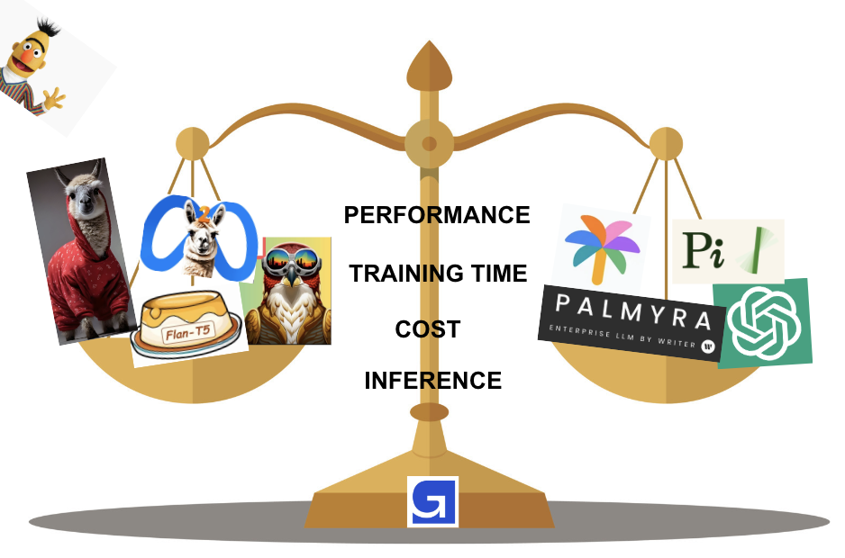

<!-- markdownlint-configure-file {
  "MD013": {
    "code_blocks": false,
    "tables": false
  },
  "MD033": false,
  "MD041": false
} -->

<div align="center">

# LLM Finetuning Hub 



LLM Finetuning Hub contains code and insights to finetune various large language models for your use-case.

We stress-test both open-source and close-source LLMs through our Evaluation Framework to check their applicability for real-life business use-cases. Finetuning LLMs has never been easier.

[Evaluation Framework](#evaluation-framework) •
[Getting Started](#getting-started) •
[LLM Roadmap](#llm-roadmap) •
[Benchmarks](#benchmarks) •
[Contributing](#contributing)

</div>

## Evaluation Framework

For a holistic evaluation, we will make use of the __Evaluation Framework__ that contains __4 pillars__:

-  Performance 
-  Time to Train 
-  Cost to Train 
-  Inferencing 


For each of the above four pillars, we are sharing our codebase and insights to:
- Assist you to leverage LLMs for your business needs and challenges
- Decide which LLM suits your needs from a performance and cost perspective
- Boost reproducibility efforts which are becoming increasingly difficult with LLMs

We are providing scripts that are ready-to-use for:
- Finetuning LLMs on your proprietary dataset via PeFT methodologies such as LoRA and Prefix Tuning
- Performing hyperparameter optimization to get the maximum performance out of these models

## Getting Started 

You can start fine-tuning your choice of LLM in 4 easy steps:

1. **Setup conda environment**

	```shell
	wget https://repo.anaconda.com/miniconda/Miniconda3-py38_4.11.0-Linux-x86_64.sh
	bash Miniconda3-py38_4.11.0-Linux-x86_64.sh
	source ~/.bashrc
	conda create --name llm_finetuning python=3.9
	conda activate llm_finetuning
	```

2. **Install relevant packages**

	```shell
	git clone https://github.com/georgian-io/LLM-Finetuning-Hub.git
	cd LLM-Finetuning-Hub/
	pip install -r requirements.txt
	```

3. **Finetune your LLM of choice**

	For instance, to finetune Llama2-7B or Llama2-13B, do the following:

	```shell
	cd llama2/ # navigate to Llama2 folder
	python llama2_classification.py --lora_r 8 --epochs 5 --dropout 0.1 --pretrained_ckpt NousResearch/Llama-2-7b-hf # finetune Llama2-7B on newsgroup classification dataset
	python llama2_classification_inference.py --experiment <experiment folder> # evaluate finetuned Llama2 7B version
	python llama2_summarization.py --lora_r 8 --epochs 1 --dropout 0.1 --pretrained_ckpt NousResearch/Llama-2-13b-hf # finetune Llama2-13B on samsum chat dataset
	python llama2_summarization_inference.py --experiment <experiment folder> # evaluate finetuned Llama2 13B version
	```

	For instance, to finetune Falcon-7B, do the following:

	```shell
	cd falcon/ # navigate to Falcon folder
	python falcon_classification.py --lora_r 8 --epochs 5 --dropout 0.1 # finetune Falcon-7B on newsgroup classification dataset
	python falcon_classification_inference.py --experiment <experiment folder> # evaluate finetuned Falcon
	python falcon_summarization.py --lora_r 8 --epochs 1 --dropout 0.1 # finetune Falcon-7B on samsum chat dataset
	python falcon_summarization_inference.py --experiment <experiment folder> # evaluate finetuned Falcon
	```

	For instance, to finetune Flan-T5-Large, do the following:

	```shell
	cd flan-t5/ # navigate to Flan-T5 folder
	python flan_classification.py --peft_method prefix --prefix_tokens 20 --epochs 5 # finetune Flan-T5 on newsgroup dataset
	python flan_classification_inference.py --experiment <experiment folder> # evaluate finetuned Flan-T5
	python flan_summarization.py --peft_method lora --lora_r 8 --epochs 1 # finetune Flan-T5 on samsum chat dataset
	python flan_summarization_inference.py --experiment <experiment folder> # evalute finetuned Flan-T5
	```

4. **Zero-shot and Few-shot your LLM of choice**

	For instance, to use Falcon-7B on newsgroup classification task, do the following:

	```shell
	python falcon_baseline_inference.py --task_type classification --prompt_type zero-shot
	python falcon_baseline_inference.py --task_type classification --prompt_type few-shot
	```

	To use Falcon-7B on samsum summarization task, do the following:

	```shell
	python falcon_baseline_inference.py --task_type summarization --prompt_type zero-shot
	python falcon_baseline_inference.py --task_type summarization --prompt_type few-shot
	```

NOTE: All of our experiments were conducted on the AWS EC2 instance: g5.2xlarge. It has one 24GB Nvidia GPU, and is sufficient to finetune the LLMs in this repository.

## LLM Roadmap

Our plan is to perform these experiments on all the LLMs below. To that end, this is a tentative roadmap of the LLMs that we aim to cover, and their corresponding codebase and README links:

| LLM        | Benchmarked?        |  Open-Source?     | README | Codebase |
|:----------:|:-------------------:|:-----------------:|:------------:|:------------:|
|Flan-T5     |:white_check_mark:   |:white_check_mark: |[Link](https://github.com/georgian-io/LLM-Finetuning-Hub/blob/main/flan-t5/README.md) | [Folder](https://github.com/georgian-io/LLM-Finetuning-Hub/tree/main/flan-t5) |
|Falcon      |:white_check_mark:   |:white_check_mark: |[Link](https://github.com/georgian-io/LLM-Finetuning-Hub/blob/main/falcon/README.md) | [Folder](https://github.com/georgian-io/LLM-Finetuning-Hub/tree/main/falcon) |
|RedPajama   |:white_check_mark:   |:white_check_mark: |[Link](https://github.com/georgian-io/LLM-Finetuning-Hub/blob/main/redPajama/README.md) | [Folder](https://github.com/georgian-io/LLM-Finetuning-Hub/tree/main/redPajama) |
|Llama-2     |:white_check_mark: |:white_check_mark: |[Link](https://github.com/georgian-io/LLM-Finetuning-Hub/blob/main/llama2/README.md) |[Folder](https://github.com/georgian-io/LLM-Finetuning-Hub/tree/main/llama2) |
|Mistral     | |:white_check_mark: | | |
|OpenLlama   | |:white_check_mark: | | |
|SalesForce XGen | |:white_check_mark: | | |
|Mosaic MPT |:white_check_mark: |:white_check_mark: |[Link](https://github.com/georgian-io/LLM-Finetuning-Hub/blob/main/mosaic-mpt/README.md) |[Folder](https://github.com/georgian-io/LLM-Finetuning-Hub/tree/main/mosaic-mpt) | 
|Cerebras | |:white_check_mark: | | |
|Writer Palmyra |:white_check_mark: |:x: |[Link](https://github.com/georgian-io/LLM-Finetuning-Hub/blob/main/palmyra/README.md) |[Folder](https://github.com/georgian-io/LLM-Finetuning-Hub/tree/main/palmyra) |
|AI21 Jurassic-2 |:white_check_mark: |:x: |[Link](https://github.com/georgian-io/LLM-Finetuning-Hub/blob/main/jurassic-2/README.md) |[Folder](https://github.com/georgian-io/LLM-Finetuning-Hub/tree/main/jurassic-2) |
|OpenAI GPT-3.5 |:white_check_mark: |:x: |[Link](https://github.com/georgian-io/LLM-Finetuning-Hub/blob/main/gpt-3.5-turbo/README.md) |[Folder](https://github.com/georgian-io/LLM-Finetuning-Hub/tree/main/gpt-3.5-turbo) |
|Google PaLM | |:x: | | |
|Inflection Pi | |:x: | | |

## Benchmarks

We benchmark LLMs across the tasks of classification and summarization. More precisely, we assess the metrics of finetuned LLMs on classification and summarization tasks. Additionally, we perform cost estimation and load testing comparisons for inference purposes. 

Note:

* RP refers to RedPajama.

<details>
<summary>### Classification: Sample efficiency VS Accuracy</summary>

We use the Newsgroup dataset which is a 20-way classification problem. Each document needs to be identified as one of the 20 possible newsgroups. To check how quickly LLMs can learn on small number of samples, we compare them with the likes of BERT and Distilbert. Following table captures how models perform as we increase the number of training samples.

|Training samples (fraction) | Distilbert | Bert | Flan-T5 Large | Falcon-7B | RP-3B | RP-7B | Llama2-7B | Llama2-13B |
|:--------------------------:|:----------:|:----:|:-------------:|:---------:|:-----:|:-----:|:---------:|:----------:|
|266   (2.5%)                |36.24       |16.91 |59.86          |61.85      |55.32  |58.17  |52.10      |66.23       |
|533   (5%)                  |46.65       |30.75 |68.84          |64.02      |57.49  |60.31  |54.72      |67.45       |
|1066  (10%)                 |54.15       |53.73 |73.38          |67.52      |65.45  |67.22  |55.97      |71.69       |
|2666  (25%)                 |67.07       |68.41 |75.45          |70.32      |67.18  |69.53  |69.20      |73.50       |
|5332  (50%)                 |72.00       |72.46 |75.43          |72.42      |70.58  |70.96  |69.09      |77.87       |
|10664 (100%)                |71.91       |74.15 |72.31          |76.37      |72.34  |75.52  |75.30      |77.93       |


<summary>### Summarization: Finetuning</summary>

We use the samsum dataset which contains chat conversations and their summarized versions. The task here is for LLMs to learn how best to summarize conversations by learning from pairs of conversations and corresponding summaries. Following table captures how LLMs perform on this task.

|Model          | Flan-T5-Base Full Fine-Tune | Flan-T5-Large | Falcon-7B | RP-3B | RP-7B | Llama2-7B | Llama2-13B |
|:-------------:|:---------------------------:|:-------------:|:---------:|:-----:|:-----:|:---------:|:----------:|
|ROUGE-1 (in %) |47.23                        |49.21          |52.18      |47.75  |49.96  |51.71      |52.97       | 
|ROUGE-2 (in %) |21.01                        |23.39          |27.84      |23.53  |25.94  |26.86      |28.32       |

</details>

### Cost estimation and load testing

We deployed the models mentioned above on two servers: FastApi and the HuggingFace Text Generation Inference server. The goal was to compare the cost and latency between our custom server, developed using FastApi, and the inference server (TGI), which comes with many built-in optimizations.

All servers were run and received inference requests on an AWS g5.4xlarge instance with Nvidia GPU A10. For load testing, we utilized Vegeta to see how the system copes with a high volume of requests. Our objective was to identify the maximum RPS each model could manage, along with throughput, latency, and cost per 1,000 tokens. We created a set of sample sentences, each about ~100 tokens long, to generate the requests. During the load testing, a random sentence was chosen for each request, ensuring consistent testing results. This method allowed us to identify the typical RPS range each model and service could handle for various tasks.

Below, two tables summarize our observations for all the models, tasks, and most used deployment options explored in this repository (we also tried LLama on Nvidia A100 using the Ray server; more details can be found [here](https://github.com/georgian-io/LLM-Finetuning-Hub/blob/main/llama2/README.md)). Generally, the TGI server is more cost-effective than the custom server and simpler to set up. It provided better RPS, throughput, and lower latency. A different inference server, [vLLm](https://vllm.readthedocs.io), can offer even higher maximum RPS compared to TGI (you can find more details about our load testing experiments with it for LLama-2 [here](https://github.com/georgian-io/LLM-Finetuning-Hub/blob/main/llama2/README.md)). Last thing to mention is that models designed for classification are slower than those for summarization. Aslo, the model's size (number of training parameters) doesn't significantly impact its performance.

#### Text Generation Inference

|                          | Classification |         |         |		  |             | 		 |Summarization|        |        |		  |         |		|
|--------------------------|----------------|---------|---------|---------|-------------|----------|-------------|--------|--------|--------|---------|--------|
| Model                    | Flan-T5 Large          | Falcon-7B  | RP-3B   | RP-7B   |  LLama2-7B |LLama2-13B |  Flan-T5 Large       | Falcon-7B |RP-3B   |RP-7B   |LLama2-7B | LLama-2-13B| 
| Inference cost (per 1K tokens)          | $0.00001   		| $0.00005 | $0.00003 | $0.00003 |    $0.00003      |$0.00003			 | $0.00001    | $0.00004|$0.00001|$0.00002|	$0.00002	    |	$0.00002	  |
| RPS                      | 145        	| 125     | 135     |    125  |     125     |125			 | 120         | 145    | 195    |145     |	135 	    |	125	|
| Throughput               | 78.5       	| 30.3    | 57.3    | 26.13   |      19.81    |	9.60		 | 45.5        | 53.8   | 96.06  |41.5	  |	36.10	    |	22.16		|
| Latency 90% (seconds)    | 1.5       		| 2.7     | 1.44    |   3.98  |      4.8    |	12.04		 | 2.03        | 1.82   | 0.7139 |2.5	  |	2.6	   |	5.15		|

#### FastApi

|                          | Classification |         |         |		  |           | 		 |Summarization|        |        |		  |         |		    |
|--------------------------|----------------|---------|---------|---------|-----------|----------|-------------|--------|--------|--------|---------|-----------|
| Model                    | Flan-T5 Large          | Falcon-7B  | RP-3B   |   RP-7B |  LLama2-7B |LLama2-13B |  Flan-T5 Large       | Falcon-7B |RP-3B   |RP-7B   |LLama2-7B | LLama2-13B  | 
| Inference cost (per 1K tokens)           | $0.00001   		| -		  | $0.001   |  $0.001 |    $0.001      |	$0.001		 | $0.00007    | -		|$0.00002|$0.00002|	$0.00003	    |	$0.0003	    |
| RPS                      | 180        	| -    	  | 4       |    4    |     4     |		4	 | 30          | -    	| 160    |160     |	100	    |	10	    |
| Throughput               | 5.84       	| -   	  | 0.15    |   0.14  |      0.11    |	0.14		 | 1.5         | - 		| 5.46   |5.27	  |	3.43	    |	1.73		|
| Latency 90% (seconds)    | 28.01       	| -    	  | 26.4    |   28.1  |      27.3    |	27.9		 | 18.27       | -   	| 28.4   |29.527  |	28.1	    |	5.1		|

In conclusion, the TGI server offers a more cost-efficient and streamlined approach compared to custom servers, delivering superior performance metrics. While classification models tend to be slower, the size of the model, in terms of training parameters, doesn't notably affect its efficiency. Choosing the right server and model type is crucial for optimizing cost and latency.

## Contributing

If you would like to contribute to this project, we recommend following the "fork-and-pull" Git workflow.

 1. **Fork** the repo on GitHub
 2. **Clone** the project to your own machine
 3. **Commit** changes to your own branch
 4. **Push** your work back up to your fork
 5. Submit a **Pull request** so that we can review your changes

NOTE: Be sure to merge the latest from "upstream" before making a pull request!

## Correspondence

If you have any questions, please reach out to:

- Rohit Saha ([Email](mailto:rohit@georgian.io) | [LinkedIn](https://www.linkedin.com/in/rohit-saha-ai/))
- Kyryl Truskovskyi ([Email](mailto:kyryl@georgian.io) | [LinkedIn](https://www.linkedin.com/in/kyryl-truskovskyi-275b7967/))
- Maria Ponomarenko ([Email](mailto:mariia.ponomarenko@georgian.io) | [LinkedIn](https://www.linkedin.com/in/maria-ponomarenko-71b465179/))

