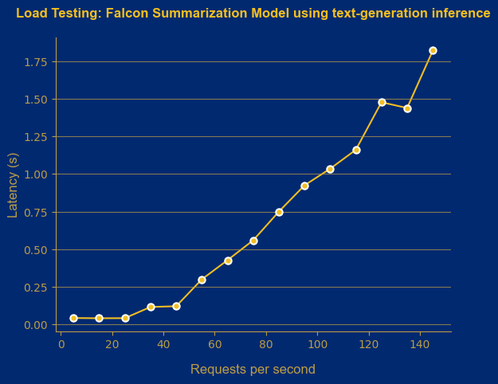
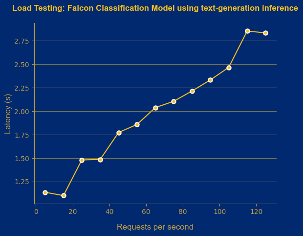

# Contents:

- [Contents:](#contents)
	- [What is Falcon?](#what-is-falcon)
	- [Variations of Falcon and Parameters](#variations-of-falcon-and-parameters)
	- [What does this folder contain?](#what-does-this-folder-contain)
	- [Evaluation Framework](#evaluation-framework)
		- [ Performance ](#-performance-)
			- [Classification](#classification)
			- [Summarization](#summarization)
		- [  Time \& Cost to Train  ](#--time--cost-to-train--)
		- [ Inference ](#-inference-)

## What is Falcon? 

Falcon is a causal decoder-only model, i.e, given a sequence of words, it can predict the most-likely next word. Falcon comes in two sizes – 7 billion and 40 billion parameters. Furthermore, each of the two sizes has two versions: (i) base, which has been pre-trained on large corpuses of text and can be fine-tuned on downstream tasks, and (ii) instruct, which has already been fine-tuned on instructions, making it favorable for out-of-the-box chatbot and Q&A applications!

## Variations of Falcon and Parameters

Falcon models come in two sizes, and can be leveraged depending on the task at hand.

| Falcon variation | Parameters  |
|:----------------:|:-----------:|
|Base-7B           |7B           |
|Instruct-7B       |7B           |           
|Base-40B          |40B          |
|Instruct-40B      |40B          |

In this repository, we have used Falcon-7B for our experiments.

## What does this folder contain? 

This folder contains ready-to-use scripts, using which you can do the following:
	
* Finetuning Falcon-7B using PeFT methodology QLoRA:
	* ```falcon_classification.py```: Finetune on News Group classification dataset
	* ```falcon_summarization.py```: Finetune on Samsum summarization dataset
* Prompts used:
	* ```prompts.py```: Zero-shot, Few-shot and instruction tuning for classification and summarization
* Perform hyperparameter optimization over a well-constrained search space:
	* ```run_lora.sh```: Ablation study on LoRA's parameters 
	* ```sample_ablate.sh```: Ablation study over sample complexities
* Infer Falcon-7B using trained checkpoints:
	* ```falcon_baseline_inference.py```: Infer in zero-shot and few-shot settings using Falcon-7B Instruct version
	* ```falcon_classification_inference.py```: Infer on News Group classification dataset
	* ```falcon_summarization_inference.py```: Infer on Samsum summarization dataset
* Infer across a different settings:
	* ```baseline_inference.sh```: Loop over all settings to perform zero-shot and few-shot prompting across classification and summarization tasks

## Evaluation Framework

In this section, we bring to you our insights after extensively experimenting with Falcon-7B across different tasks. For a thorough evaluation, we need to evaluate the __four pillars__:

* Performance
* Cost to Train
* Time to Train
* Inference Costs


###  Performance 

We evaluated Falcon-7B under the following conditions:

* Tasks & Datasets:
	* Classification: News Group dataset, which is a 20-way classification task.
	* Summarization: Samsum dataset. 
* Competing Models:
	* BERT-Base (110M parameters)
	* Distilbert (66M parameters)
	* Flan-T5 Large (780M parameters)
* Experiments:
	* Zero-Shot prompting vs Few-Shot prompting vs PeFT QLoRA
	* Sample Efficiency vs Accuracy
* Training config:
	* Epochs: 5
	* Falcon-7B:
		* PeFT technique: QLoRA
		* Learning rate: 2e-4
	* Flan-T5 Large:
		* PeFT technique: LoRA
		* Learning rate: 1e-3
	* BERT/Distilbert:
		* Learning rate: 2e-5
* Hardware:
	* Cloud provider: AWC EC2
	* Instance: g5.2xlarge
	
#### Classification ####

<u> Table 1: Zero-Shot prompting vs Few-Shot prompting vs Fine-Tuning QLoRA </u>

|Method          | Zero-Shot  | Few-Shot | Fine-Tuning + QLoRA |
|:--------------:|:----------:|:--------:|:-------------------:|
|Accuracy (in %) |1.08        |:x:       |76.37                |


NOTE: 

* ```prompts.py``` contains the prompts used for zero-shot prompting, few-shot prompting and instruction tuning.
* For zero-shot and few-shot experiments, we used Falcon-7B-Instruct version. For instruction tuning, we used Faclon-7B-Base as per recommendations.


<u> Table 2: Sample Efficiency vs Accuracy </u>

|Training samples (fraction) | Distilbert | Bert | Flan-T5 Large + LoRA | Falcon-7B + QLoRA |
|:--------------------------:|:----------:|:----:|:--------------------:|:-----------------:|
|266   (2.5%)                |36.24       |16.91 |59.86                 |61.85              |
|533   (5%)                  |46.65       |30.75 |68.84                 |64.02              |
|1066  (10%)                 |54.15       |53.73 |73.38                 |67.52              |
|2666  (25%)                 |67.07       |68.41 |75.45                 |70.32              |
|5332  (50%)                 |72.00       |72.46 |75.43                 |72.42              |
|10664 (100%)                |71.91       |74.15 |72.31                 |76.37              |

<u> Insight: </u>

We can see that Falcon-7B does a better job when compared to other models on a sample size as low as ~250! At roughly 50% of training samples, Distilbert and Bert finally catch-up to Falcon-7B, making Falcon-7B a great candidate to consider in low-data situations. 

#### Summarization ####

<u> Table 3: Zero-Shot prompting vs Few-Shot prompting vs Fine-Tuning QLoRA </u>

|Method         | Zero-Shot  | Few-Shot  | Fine-Tuning + QLoRA |
|:-------------:|:----------:|:---------:|:-------------------:|
|ROUGE-1 (in %) |32.21       |34.12      |52.18                |
|ROUGE-2 (in %) |10.08       |11.9       |27.84                |

<u> Insight: </u>

Falcon-7B does a much better job at summarizing dialogues than classifying news documents in zero-shot and few-shot settings. But Fine-Tuning is still most effective as it helps Falcon-7B learn the summarization style specific to the dataset as opposed to creating a generic summary. It is, however, surprising that Few-Shot prompting yields lower ROUGE scores than zero-shot prompting.

<u> Table 4: Falcon-7B vs Other LLMs </u>

|Model          | Flan-T5-Base Full Fine-Tune | Flan-T5-Large + LoRA | Falcon-7B + QLoRA |
|:-------------:|:---------------------------:|:--------------------:|:-----------------:|
|ROUGE-1 (in %) |47.23                        |49.21                 |52.18              |
|ROUGE-2 (in %) |21.01                        |23.39                 |27.84              |

<u> Insight: </u>

Falcon-7B outperforms Flan-T5-Large and Flan-T5-Base versions, showcasing its superiority for summarization tasks. Furthermore, these results prove the merits of fine-tuning Falcon-7B on target datasets as opposed to just using it out-of-the-box. 

###   Time & Cost to Train  

Conditions:

* AWS EC2 instance : g5.2xlarge
* Cost             : $1.212 / hour
* GPU included     : NVIDIA A10G: 24GB
* Epochs           : 5

<u> Table 5: Time & Cost to Train </u>

|Task           |Training Time | Training Cost |
|:-------------:|:------------:|:-------------:|
|Classification |2 hours       |$2.424         |
|Summarization  |3 hours       |$3.636         |


###  Inference 

With inference, we used the same approach for deployment and cost estimation for the Flan model. 

Following the same process we used to test Flan-T5-Large, we are using the load testing tool, Vegeta, on Falcon. We created a script that sent varying numbers of requests (ranging from 5 to 185) in three sets, with a three-second interval to give the server time to recover. Afterward, we examined the results, excluding instances where a "too many requests" error occurred. We calculated the average throughput and latency (90%) for the maximum possible requests per second (RPS) and used this data to calculate the cost. Again, following the same process we used to test Flan-T5-Large,  all of the load testing experiments have been executed on a g5.4xlarge instance.

For the summarization task, we varied the RPS from five to 180. 90% of all requests had a response time equal to or less than 1.82 seconds for 145 RPS (which is the maximum number of requests the server was able to handle). 

As for the cost, taking into account that the throughput value was reported as 53.8, to get this number of responses in one second (or to get 145 responses in ~1.82 seconds) will cost you $0.0008.

<u> Table 6: Cost estimation of deploying Falcon-7B + LoRA for summarization task </u>

|     Server   | Inference cost     | Requests per second (rps) | Throughput | Latency 90% |
|:------------:|:------------------:|:-------------------------:|:----------:|:-----------:|
|text-generation| $0.00004 / 1K tokens|			145				|	53.8	 |	1.82 s.    |



The performance of the classification model during inference is quite similar to the summarization. The maximum RPS that TGI was able to handle equals to 125. 

Taking into account the latency value, it will cost $0.001 to get responses for 125 requests in 2.7s. 

<p></p>
<u> Table 7: Cost estimation of deploying Falcon-7B + LoRA for classification task </u>
<p></p>

|     Server   | Inference cost        | Requests per second (rps)  | Throughput | Latency 90% |
|:------------:|:---------------------:|:--------------------------:|:----------:|:-----------:|
|text-generation|$0.00005 / 1K tokens   |        125				|   30.3 	 |  2.7 s.     |
<p></p>



