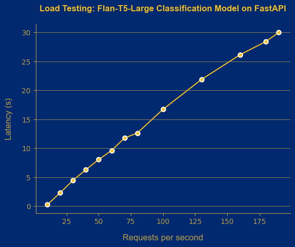

# Contents:

- [Contents:](#contents)
	- [What is Flan-T5?](#what-is-flan-t5)
	- [Variations of Flan-T5 and Parameters](#variations-of-flan-t5-and-parameters)
	- [What does this folder contain?](#what-does-this-folder-contain)
	- [Evaluation Framework](#evaluation-framework)
		- [ Performance ](#-performance-)
		- [  Time \& Cost to Train  ](#--time--cost-to-train--)
		- [ Inference ](#-inference-)
			- [FastApi](#fastapi)
			- [HuggingFace Text Generation Inference](#huggingface-text-generation-inference)
	- [Ablation Studies](#ablation-studies)
		- [Classification Studies](#classification-studies)
		- [Summarization Studies:](#summarization-studies)

## What is Flan-T5? 

Flan-T5 is an open-source LLM that’s available for commercial usage. Published by Google researchers, Flan-T5 is an encoder-decoder model pre-trained on a variety of language tasks. The model has been trained on supervised and unsupervised datasets with the goal of learning mappings between sequences of text, i.e., text-to-text. What sets Flan-T5 apart from other models is that its training is based on prompting. In other words, the model has a very good knowledge of performing specific tasks such as __summarization__, __classification__ and __translation__ to name a few.

## Variations of Flan-T5 and Parameters

Flan-T5 models come in different sizes, and can be leveraged depending on the task at hand.

| Flan-T5 variation | Parameters  |
|:-----------------:|:-----------:|
|Small              |80M          |
|Base               |250M         |           
|Large              |780M         |
|XL                 |3B           |
|XXL                |11B          |

In this repository, we have used Flan-T5-Large for our experiments.

## What does this folder contain? 

This folder contains ready-to-use scripts, using which you can do the following:
	
* Finetuning Flan-T5-Large using PeFT methodologies such as LoRA & Prefix Tuning:
	* ```flan_classification.py```: Finetune on News Group classification dataset
	* ```flan_summarization.py```: Finetune on Samsum summarization dataset
* Perform hyperparameter optimization over a well-constrained search space:
	* ```run_lora.sh```: Ablation study on LoRA's parameters
	* ```run_prefix.sh```: Ablation studu on Prefix Tuning's parameters
* Infer Flan-T5-Large using trained checkpoints:
	* ```flan_classification_inference.py```: Infer on News Group classification dataset
	* ```flan_summarization_inference.py```: Infer on Samsum summarization dataset
* Infer across a bunch of checkpoints:
	* ```inference.sh```: Loop over all experiments in the relevant folder, and save metrics corresponding to each experiment in its folder 

## Evaluation Framework

In this section, we bring to you our insights after extensively experimenting with Flan-T5-Large across different tasks. For a thorough evaluation, we need to evaluate the __four pillars__:

* Performance
* Cost to Train
* Time to Train
* Inference Costs


###  Performance 

We evaluated Flan-T5-Large under the following conditions:

* Tasks & Datasets:
	* Classification: News Group dataset, which is a 20-way classification task.
	* Summarization: Samsum dataset. 
* Competing Models:
	* BERT-Base (110M parameters)
	* Distilbert (66M parameters)
* Experiments:
	* Sample Efficiency vs Accuracy
* Training config:
	* Epochs: 5
	* Flan-T5-Large:
		* PeFT technique: LoRA
		* Learning rate: 1e-3
	* BERT/Distilbert:
		* Learning rate: 2e-5
* Hardware:
	* Cloud provider: AWC EC2
	* Instance: g5.2xlarge
	

<u> Table 1: Sample Efficiency vs Accuracy </u>

|Training samples (fraction) | Distilbert | Bert | Flan-T5 Large + LoRA |
|:--------------------------:|:----------:|:----:|:--------------------:|
|266   (2.5%)                |36.24       |16.91 |59.86                 |
|533   (5%)                  |46.65       |30.75 |68.84                 |
|1066  (10%)                 |54.15       |53.73 |73.38                 |       
|2666  (25%)                 |67.07       |68.41 |75.45                 |
|5332  (50%)                 |72.00       |72.46 |75.43                 |
|10664 (100%)                |71.91       |74.15 |72.31                 |

<u> Insight: </u>

We can see that Flan-T5-Large does a significantly better job when compared to Distilbert and Bert on a sample size as low as ~250! As we steadily increase the number of samples, Distilbert and Bert finally catch-up to Flan-T5-Large, making Flan-T5-Large a great candidate to consider in low-data situations. 

###   Time & Cost to Train  

Conditions:

* AWS EC2 instance : g5.2xlarge
* Cost             : $1.212 / hour
* GPU included     : NVIDIA A10G: 24GB
* Epochs           : 5

<u> Table 2: Samples vs Time & Cost </u>

|Training samples (fraction) |Training Time | Training Cost |
|:--------------------------:|:------------:|:-------------:|
|266   (2.5%)                |3  mins       |$0.060         |
|533   (5%)                  |6  mins       |$0.121         |
|1066  (10%)                 |12 mins       |$0.242         | 
|2666  (25%)                 |30 mins       |$0.606         |
|5332  (50%)                 |1  hour       |$1.212         |
|10664 (100%)                |2  hours      |$2.424         |

<u> Insight: </u>

Since we are performing PeFT, the number of trainable parameters in a Flan-T5-Large is significantly lower. As a result, the model converges faster, leading to insignificant cost figures.

###  Inference 

We use a basic setup with FastAPI server without any optimization under the hood. 

All benchmarks were conducted on a g5.4xlarge AWS instance costing $1.624 (on-demand price as of June 2023). For stress-testing purposes, we used a load-testing tool called Vegeta and loaded the web servers with an increasing number of requests per second (RPS) until latency started to degrade significantly, or we started getting timeout errors. We conducted experiments for each RPS value multiple times (3-6 times) and calculated the average latency and throughput.

It is worth mentioning that when we perform a load test with a tool like Vegeta and set the request rate to n requests per second, it means that the tool attempts to simulate an average of n requests per second over the duration of the test. It doesn't guarantee that exactly n requests will be served and completed within each second.

Inference costs are derived from:
- Total tokens server can process in 1 hour = (rps * average number of tokens (input + output) * 60 seconds * 60 minutes)
- Price per hour = from AWS 
- Inference cost = Price per hour / (Total tokens in 1 hour / 1000)

This is a specific calculation, but using it makes it easy to compare other LLMs, including closed LLM APIs (such as GPT-4 and Writer Parmila). 


<u> Table 3: Cost estimation of deploying Flan-T5-Large + LoRA for summarization task </u>

|     Server   | Inference cost     | Requests per second (rps) | Throughput | Latency 90% |
|:------------:|:------------------:|:-------------------------:|:----------:|:-----------:|
|	FastAPI    |$0.00007 / 1K tokens|			30 			    |	1.5		 |	18.27 s.   | 
|text-generation| $0.00001 /1K tokens|			120				|	45.5	 |	2.03 s.    |

<p></p>
<u> Table 4: Cost estimation of deploying Flan-T5-Large + LoRA for classification task </u>
<p></p>

|     Server   | Inference cost        | Requests per second (rps)  | Throughput | Latency 90% |
|:------------:|:---------------------:|:--------------------------:|:----------:|:-----------:|
|	FastAPI    |$0.00001 / 1K tokens|			180 			|	5.84	 |	28.01 s.   | 
|text-generation|$0.00001 /1K tokens   |        145				|   78.5 	 |  1.5 s.     |


#### FastApi ####

For the summarization task we varied the RPS from 5 to 30, and examined the system's responsiveness across different load levels. We discovered that 90% of all requests had a response time equal to or less than 18.27 seconds (for 30 RPS). The plot also shows that as RPS increases, the 90th percentile latency rises gradually, signaling potential performance limitations. We found out that 35 requests per second is a critical threshold where the system fails.

The Throughput value was reported as 1.5. This value represents the average number of requests successfully completed per second during the load test. 

<p></p>

<p></p>

We performed the same load testing experiments for the classification task. Here the maximum number of requests the system can cope with is much higher — 180 requests per second.

<p></p>


#### HuggingFace Text Generation Inference ####

Text Generation Inference server developed by HuggingFace allows faster text generation by using advanced techniques like Tensor Parallelism and dynamic batching with popular open-source Language Model Libraries (LLMs) such as StarCoder, BLOOM, GPT-NeoX, Llama, and T5.

This time for the summarization task we varied the RPS value from 5 to 120. 90% of all requests had a response time equal to or less than 2.03 seconds (for 120 RPS). 

The Throughput value was reported as 45.5, which is much greater than the value we were able to get using FastApi. 

<p></p>


As for the classification task, the maximum RPS that the server was able to handle equals to 145. The Throughput value is 78.5 which is much higher than the value we got during load testing of FastApi. Moreover the Latency (90%) is also lower and equals to 1.5 s per request. 

<p></p>


## Ablation Studies

While you can use the above scripts with default hyperparameter settings, it is often recommended to run a search over hyperparameters on your dataset. To show how different hyperparameter settings can affect Flan-T5-Large's performance, we share ablation studies for both tasks of Classification and Summarization.

Since we use PEFT methodolgies, LoRA and Prefix Tuning, we ablate over their settings:

* Epochs: [2, 5, 10]
* LoRA:
	* Dropout rates: [0.1, 0.2]
	* R (Rank of matrix): [2, 4, 8, 16]
* Prefix Tuning:
	* Dropout rates: [0.1, 0.2]
	* Prefix Tokens: [10, 50, 100]
	* Prefix Projection: [0, 1]
	
### Classification Studies

Following are the results of our ablation studies:

<u> Table 3: Classification & LoRA </u>

|Epochs | Rank (R) | Dropout Rate | Accuracy |
|:-----:|:--------:|:------------:|:--------:|
|2      |2         |0.1           |65.72     |
|2      |2         |0.2           |72.80     |
|2      |4         |0.1           |74.93     |
|2      |4         |0.2           |72.81     |
|2      |8         |0.1           |74.54     |
|2      |8         |0.2           |75.42     |
|2      |16        |0.1           |76.25     |
|2      |16        |0.2           |69.56     |
|5      |2         |0.1           |69.51     |
|5      |2         |0.2           |68.58     |
|5      |4         |0.1           |72.80     |
|5      |4         |0.2           |71.83     |
|5      |8         |0.1           |73.17     |
|5      |8         |0.2           |73.21     |
|5      |16        |0.1           |73.54     |
|5      |16        |0.2           |72.44     |
|10     |2         |0.1           |61.80     |
|10     |2         |0.2           |59.99     |
|10     |4         |0.1           |65.90     |
|10     |4         |0.2           |66.20     |
|10     |8         |0.1           |69.65     |
|10     |8         |0.2           |66.10     |
|10     |16        |0.1           |68.81     |
|10     |16        |0.2           |70.43     |


<u> Table 4: Classification & Prefix Tuning </u>

Since there are a total of 36 experiments, we choose a subset to demonstrate the effect of different hyperparameters. For your experiments, we would still recommend running the full search.
 
|Epochs | Prefix Tokens | Prefix Projection | Accuracy |
|:-----:|:-------------:|:-----------------:|:--------:|
|2      |50             |1                  |10.85     |
|5      |10             |0                  |59.73     |
|5      |50             |0                  |63.39     |
|5      |100            |0                  |66.50     |
|10     |10             |1                  |7.08      |
|10     |50             |1                  |10.44     |
|10     |100            |1                  |15.11     |
|10     |10             |0                  |68.98     |
|10     |50             |0                  |70.85     |
|10     |100            |0                  |72.23     |


<u> Classification Insights: </u>

* From Table 3, we can see that lower epochs i.e., 2 and 5, seem to achieve better performance. It is likely that training for 10 epochs is causing the model to overfit.
* Furthermore, from Table 3, it can be noted that higher values of the Rank (R) tend to give better results.
* From Table 4, it can be seen that, keeping everything else the same, disabling Prefix Projection helps achieve better performance. Higher Prefix Tokens and training for more epochs tends to lift model performance.
* Across Tables 3 and 4, LoRA outperforms Prefix Tuning under several hyperparameter settings.


### Summarization Studies:

Following are the results of our experiments:

<u> Table 5: Summarization & LoRA </u>

|Epochs | Rank (R) | Dropout Rate | ROUGE-1 | ROUGE-2 | ROUGE-L |
|:-----:|:--------:|:------------:|:-------:|:-------:|:-------:|
|2      |2         |0.1           |48.30    |22.28    |38.91    |
|2      |2         |0.2           |47.99    |22.31    |38.78    |
|2      |4         |0.1           |47.67    |21.51    |38.50    |
|2      |4         |0.2           |48.40    |22.17    |39.03    |
|2      |8         |0.1           |47.46    |21.30    |38.12    |
|2      |8         |0.2           |48.08    |21.69    |38.65    |
|2      |16        |0.1           |48.82    |23.08    |39.59    |
|2      |16        |0.2           |48.35    |22.46    |38.93    |
|5      |2         |0.1           |48.41    |22.13    |38.83    |
|5      |2         |0.2           |48.53    |22.03    |39.09    |
|5      |4         |0.1           |48.36    |22.23    |38.87    |
|5      |4         |0.2           |48.91    |22.48    |39.16    |
|5      |8         |0.1           |48.97    |23.54    |39.80    |
|5      |8         |0.2           |48.95    |22.97    |39.42    |
|5      |16        |0.1           |48.74    |22.56    |39.61    |
|5      |16        |0.2           |49.36    |23.39    |40.22    |
|10     |2         |0.1           |48.91    |22.87    |39.53    |
|10     |2         |0.2           |48.34    |22.25    |38.99    |
|10     |4         |0.1           |48.20    |22.13    |38.84    |
|10     |4         |0.2           |48.62    |22.51    |39.16    |
|10     |8         |0.1           |49.59    |23.67    |40.29    |
|10     |8         |0.2           |49.47    |23.55    |40.42    |
|10     |16        |0.1           |49.11    |23.26    |39.85    |
|10     |16        |0.2           |48.71    |22.54    |39.52    |


<u> Table 6: Summarization & Prefix Tuning </u>
 
|Epochs | Prefix Tokens | Prefix Projection | ROUGE-1 | ROUGE-2 | ROUGE-L |
|:-----:|:-------------:|:-----------------:|:-------:|:-------:|:-------:|
|2      |50             |1                  |48.83    |22.54    |39.32    |
|5      |10             |0                  |47.99    |21.96    |38.68    |
|5      |50             |0                  |47.86    |21.61    |38.40    |
|5      |100            |0                  |48.33    |21.55    |38.73    |
|10     |10             |1                  |49.25    |22.63    |39.73    |
|10     |50             |1                  |47.81    |21.87    |38.70    |
|10     |100            |1                  |47.18    |21.01    |38.19    |
|10     |10             |0                  |48.01    |21.63    |38.44    |
|10     |50             |0                  |47.85    |21.89    |38.33    |
|10     |100            |0                  |48.14    |22.09    |39.08    |


<u> Summarization Insights: </u>

* Based on Table 5 and Table 6, we do not find any one method to outperform the other when considering ROUGE-1.
* When considering ROUGE-2, LoRA experiments achieve higher scores when compared with Prefix Tuning experiments.
