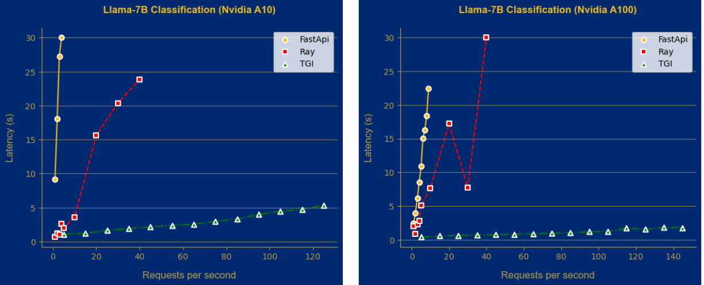
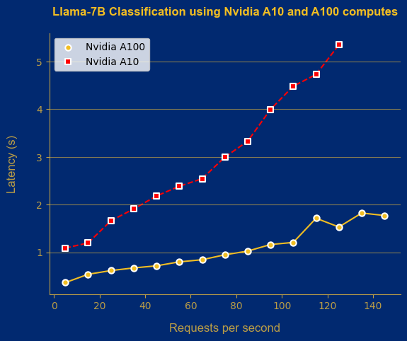
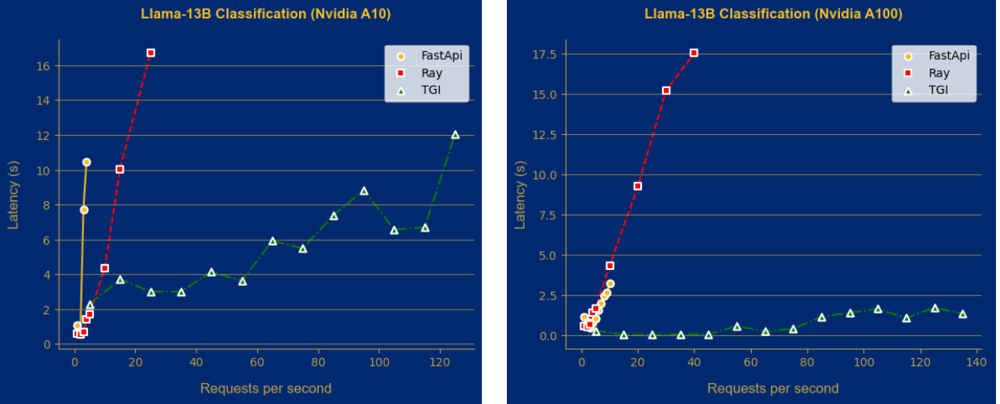
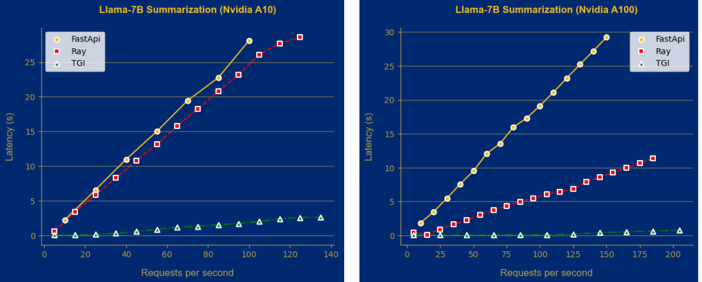
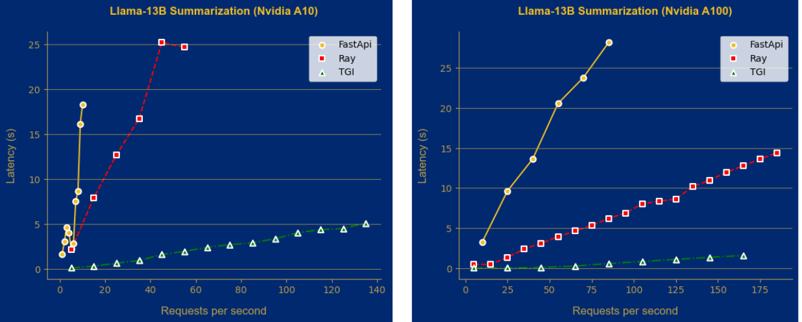

Important: Llama2 has the option of using flash attention to speed up inference. In order to use flash attention, please do:

```shell
MAX_JOBS=4 pip install flash-attn --no-build-isolation
```

# Contents:

- [Contents:](#contents)
	- [What is Llama2?](#what-is-llama2)
	- [Variations of Llama2 and Parameters](#variations-of-llama2-and-parameters)
	- [What does this folder contain?](#what-does-this-folder-contain)
	- [Evaluation Framework](#evaluation-framework)
		- [ Performance ](#-performance-)
			- [Classification](#classification)
			- [Summarization](#summarization)
		- [  Time \& Cost to Train  ](#--time--cost-to-train--)
		- [ Inference ](#-inference-)
			- [Llama-7B Classification](#llama-7b-classification)
			- [Llama-13B Classification](#llama-13b-classification)
			- [Llama-7B Summarization](#llama-7b-summarization)
			- [Llama-13B Summarization](#llama-13b-summarization)

## What is Llama2? 

Llama 2 is the latest addition to the open-source large language model that is released by Meta. Based on Meta’s benchmarking results, it is the best available open-source large language model that can also be used for commercial purposes. Llama 2 comes in 3 different versions: 7B, 13B, and 70B.

## Variations of Llama2 and Parameters

Llama2 models come in two sizes, and can be leveraged depending on the task at hand.

| Llama2 variation | Parameters  |
|:----------------:|:-----------:|
|Base-7B           |7B           |
|Base-13B          |13B          |           
|Base-70B          |70B          |

In this repository, we have experimented with the 7B and 13B variations. 

## What does this folder contain? 

This folder contains ready-to-use scripts, using which you can do the following:
	
* Finetuning Llama2 using PeFT methodology QLoRA:
	* ```llama2_classification.py```: Finetune on News Group classification dataset
	* ```llama2_summarization.py```: Finetune on Samsum summarization dataset
* Prompts used:
	* ```prompts.py```: Zero-shot, Few-shot and instruction tuning for classification and summarization
* Perform hyperparameter optimization over a well-constrained search space:
	* ```run_lora.sh```: Ablation study on LoRA's parameters 
	* ```sample_ablate.sh```: Ablation study over sample complexities
* Infer Llama2 using trained checkpoints:
	* ```llama2_baseline_inference.py```: Infer in zero-shot and few-shot settings using Llama2-3B or 7B Instruct versions
	* ```llama2_classification_inference.py```: Infer on News Group classification dataset
	* ```llama2_summarization_inference.py```: Infer on Samsum summarization dataset
* Infer across a different settings:
	* ```baseline_inference.sh```: Loop over all settings to perform zero-shot and few-shot prompting across classification and summarization tasks

## Evaluation Framework

In this section, we bring to you our insights after extensively experimenting with Llama2-7B and 13B across different tasks. For a thorough evaluation, we need to evaluate the __four pillars__:

* Performance
* Cost to Train
* Time to Train
* Inference Costs


###  Performance 

We evaluated Llama2 under the following conditions:

* Tasks & Datasets:
	* Classification: News Group dataset, which is a 20-way classification task.
	* Summarization: Samsum dataset. 
* Competing Models:
	* BERT-Base (110M parameters)
	* Distilbert (66M parameters)
	* Flan-T5 Large (780M parameters)
	* Falcon-7B (7B parameters)
	* RedPajama (3B / 7B parameters)
* Experiments:
	* Sample Efficiency vs Accuracy
	* Zero-Shot prompting vs Few-Shot prompting vs PeFT QLoRA
* Training config:
	* Epochs: 5
	* Llama2-7B/13B:
		* PeFT technique: QLoRA
		* Learning rate: 2e-4
	* RedPajama 3B/7B:
		* PeFT technique: QLoRA
		* Learning rate: 2e-4
	* Falcon-7B:
		* PeFT technique: QLoRA
		* Learning rate: 2e-4
	* Flan-T5 Large:
		* PeFT technique: LoRA
		* Learning rate: 1e-3
	* BERT/Distilbert:
		* Learning rate: 2e-5
* Hardware:
	* Cloud provider: AWC EC2
	* Instance: g5.2xlarge
	
#### Classification ####

<u> Table 1: Sample Efficiency vs Accuracy </u>

|Training samples (fraction) | Distilbert | Bert | Flan-T5 Large | Falcon-7B | RP-3B | RP-7B | Llama2-7B | Llama2-13B |
|:--------------------------:|:----------:|:----:|:-------------:|:---------:|:-----:|:-----:|:---------:|:----------:|
|266   (2.5%)                |36.24       |16.91 |59.86          |61.85      |55.32  |58.17  |52.10      |66.23       |
|533   (5%)                  |46.65       |30.75 |68.84          |64.02      |57.49  |60.31  |54.72      |67.45       |
|1066  (10%)                 |54.15       |53.73 |73.38          |67.52      |65.45  |67.22  |55.97      |71.69       |
|2666  (25%)                 |67.07       |68.41 |75.45          |70.32      |67.18  |69.53  |69.20      |73.50       |
|5332  (50%)                 |72.00       |72.46 |75.43          |72.42      |70.58  |70.96  |69.09      |77.87       |
|10664 (100%)                |71.91       |74.15 |72.31          |76.37      |72.34  |75.52  |75.30      |77.93       |

<u> Insight: </u>

The above table shows how performance of different LLMs track with sample efficiency. The last row of the table demonstrates the performance when the entire dataset is used. We can see that Llama2-13B outperforms all other models in terms of accuracy. Moreover, the first row of the table corresponding to the lowest fraction of training samples show a similar trend. Llama2-13B achieves the best performance in a low data situation across all models.

Llama2-7B, the smallest version of Llama, is unable to achieve competitive results when compared with other models across different sample fractions. This shows the significance of the extra parameters contained in Llama2-13B in comparison to Llama2-7B.


#### Summarization ####

<u> Table 2: Zero-Shot prompting vs Few-Shot prompting vs Fine-Tuning QLoRA </u>

|Method         | Llama2-7B Zero-Shot  | Llama2-7B Few-Shot  | Fine-Tuning + QLoRA |
|:-------------:|:--------------------:|:-------------------:|:-------------------:|
|ROUGE-1 (in %) |30.06                 |35.57                |51.71                |
|ROUGE-2 (in %) |8.61                  |14.23                |26.86                |


|Method         | Llama2-13B Zero-Shot  | Llama2-13B Few-Shot  | Fine-Tuning + QLoRA |
|:-------------:|:---------------------:|:--------------------:|:-------------------:|
|ROUGE-1 (in %) |11.02                  |22.50                 |52.97                |
|ROUGE-2 (in %) |3.38                   |9.25                  |28.32                |


<u> Insight: </u>

The Llama2-7B version performs significantly better than Llama2-13B in a zero-shot and few-shot setting. Looking at the ROUGE-1 and ROUGE-2 scores, we see that Llama2-7B’s performance consistently shines in comparison to Llama2-13B. However, post fine-tuning with QLoRA, Llama2-13B comes out ahead by a small margin. In our opinion, Llama2-7B can be a great candidate to consider for summarization and QnA tasks as it delivers strong results despite being smaller than Llama2-13B.


<u> Table 3: Llama2 vs Other LLMs </u>

|Model          | Flan-T5-Base Full Fine-Tune | Flan-T5-Large | Falcon-7B | RP-3B | RP-7B | Llama2-7B | Llama2-13B |
|:-------------:|:---------------------------:|:-------------:|:---------:|:-----:|:-----:|:---------:|:----------:|
|ROUGE-1 (in %) |47.23                        |49.21          |52.18      |47.75  |49.96  |51.71      |52.97       | 
|ROUGE-2 (in %) |21.01                        |23.39          |27.84      |23.53  |25.94  |26.86      |28.32       |

<u> Insight: </u>

Both versions of Llama2 achieve competitive results, with Llama2-13B taking the lead once again. In our opinion, Llama2 and Falcon are good candidates to consider for summarization tasks. The 7B versions of both Llama2 and Falcon can deliver good performance at potentially lower latencies.

###   Time & Cost to Train  

Conditions:

* AWS EC2 instance : g5.2xlarge
* Cost             : $1.212 / hour
* GPU included     : NVIDIA A10G: 24GB
* Epochs           : 5

<u> Table 4: Llama2-7B Time & Cost to Train </u>

|Task           |Training Time | Training Cost |
|:-------------:|:------------:|:-------------:|
|Classification |2 hours       |$2.424         |
|Summarization  |3 hours       |$3.636         |


<u> Table 5: Llama2-13B Time & Cost to Train </u>

|Task           |Training Time | Training Cost |
|:-------------:|:------------:|:-------------:|
|Classification |3 hours       |$3.636         |
|Summarization  |4 hours       |$4.848         |


###  Inference 

This time we extended our usual set of deployment methods and computes with an open-source unified compute framework Ray and new instance equipped with an NVIDIA A100 40GB gpu. We wanted to check how drastically the inference can be improved with a more powerful compute and what other deployment options are worth looking at. 

Talking about the benchmark tools, similar to the previous blogposts we use a load testing tool Vegeta and aim to find the maximum amount of requests that the server is able to handle (RPS). We were also looking at throughput and latency. We constructed a set of sample sentences, each comprising approximately 100 tokens, to generate the requests. For each request during the load testing, we randomly picked a sentence from this collection. This method aims to maintain the consistency of our test outcomes. Through trials, we identified the standard RPS capacities each model and service could manage for every task. 

In terms of instances, we used a GCP compute engine with an Nvidia A100 40GB GPU for $3.81 an hour. For a cheaper option, we usually went with the AWS g5.4xlarge with an Nvidia A10G 24GB GPU at $1.624 an hour.

As it was mentioned earlier, we did experiments with a new framework called Ray. It provides a scalable model serving library for building online inference APIs called Ray Serve. Even though we used it without any optimizations like dynamic batching or multi-node/multi-GPU serving, it showed good performance compared to HuggingFace Text Generation Inference (TGI) for certain tasks like summarization. For FastApi, we used 2 workers to serve the model. This is the optimal number for LLama models to prevent "Out of Memory" errors and introduce parallelism to the request handling process. Talking about TGI we traditionally merged base LLama models with Lora layers in order to complete the requirement for serving. 

#### Llama-7B Classification
| Metric                   | Nvidia A10 |         |         |         | Nvidia A100 |        |        ||
|--------------------------|------------|---------|---------|---------|-------------|--------|--------|---|
|                          | FastApi    | TGI     | Ray     |vLLm| FastApi     | TGI    | Ray    | vLLm |
| Inference cost (per 1K tokens) | $0.001  | $0.00003| $0.0001| < $0.00002| $0.001     | $0.00007 | $0.0003|< $0.00001|
| RPS                      | 4          | 125     | 30      | > 185| 9           | 145    | 30     |> 280|
| Throughput               | 0.11       | 19.81   | 2.20    |21.03| 0.45        | 54.41  | 3.71   |87.96|
| Latency 90% (seconds)    | 27.3       | 4.8     | 13.03   |8.15| 19.4        | 1.74   | 7.6    |2.9|

For classification task, Text Generation Inference outperformed all other deployment methods. However Ray can handle much more requests then FastApi and costs also 10x less. 



We took TGI results in order to show the difference in performance when working with different compute instances. As shown in the picture the latency changes drastically when using A100 GPU as well as a throughput (54.41 compared to 19.81 that we got using g5.4xlrage instance) and the cost for the 1K tokens ($0.00007) is not much higher than when using A10 instance ($0.00003).



#### Llama-13B Classification

| Metric                   | Nvidia A10 |         |         | Nvidia A100 |        |        ||
|--------------------------|------------|---------|---------|-------------|--------|--------|-|
|                          | FastApi    | TGI     | Ray     | FastApi     | TGI    | Ray    |vLLm|
| Inference cost           | $0.001     | $0.00003| $0.0001 | $0.001      | $0.00008| $0.0001| < $0.00003|
| RPS                      | 4          | 125     | 25      | 10          | 135    | 40     | > 280|
| Throughput               | 0.14       | 9.60    | 1.44    | 2.86        | 64.60  | 2.21   |51.46|
| Latency 90% (seconds)    | 27.9       | 12.04   | 12.5    | 3.02        | 1.185  | 17.5   |4.4|



The results for LLama-13B for classification task show the same tendency as for the LLama-7B. TGI again outperforms all other deployment methods.

#### Llama-7B Summarization

| Metric                   | Nvidia A10 |         |         || Nvidia A100 |        |        ||
|--------------------------|------------|---------|---------|---------|-------------|--------|--------|--|
|                          | FastApi    | TGI     | Ray     |vLLm| FastApi     | TGI    | Ray    |vLLm|
| Inference cost           | $0.00003   | $0.00002| $0.00002| < $0.00001| $0.00005    | $0.00004| $0.00004| < $0.00002|
| RPS                      | 100        | 135     | 125     |290| 150         | 205    | 185    |290|
| Throughput               | 3.43       | 36.10   | 4.04    |31.62| 4.97        | 119.13 | 15.08  |99.39|
| Latency 90% (seconds)    | 28.1       | 2.6     | 28.5    |8.2| 29.2        | 0.75   | 11.4   |2.01|



For the summarization task the difference in RPS doesn’t differ that much across all deployment options. However TGI showed amazing results when running on a GCP machine with A100 GPU that resulted in a quite big number of possible requests (205) and very small latency (0.75 seconds). 

#### Llama-13B Summarization

| Metric                   | Nvidia A10  |         |         | Nvidia A100 |         |         ||
|--------------------------|-------------|---------|---------|-------------|---------|---------|---------|
|                          | FastApi     | TGI     | Ray     | FastApi     | TGI     | Ray     |vLLm|
| Inference cost           | $0.0003     | $0.00002| $0.00006| $0.0001     | $0.00005| $0.00006|$0.00002|
| RPS                      | 10          | 125     | 55      | 85          | 165     | 135     |290|
| Throughput               | 1.73        | 22.16   | 2.18    | 2.83        | 64.01   | 11.98   |55.92|
| Latency 90% (seconds)    | 5.1         | 5.15    | 24.6    | 27.8        | 1.6     | 10.3    |4.24|

Looking at the benchmarking results for Ray for the summarization task we can also say that it greatly outperforms FastApi (55 RPS compared to FastApi 10 RPS on Nvidia A10) which results in much lower cost ($0.00006 on both instances). 


